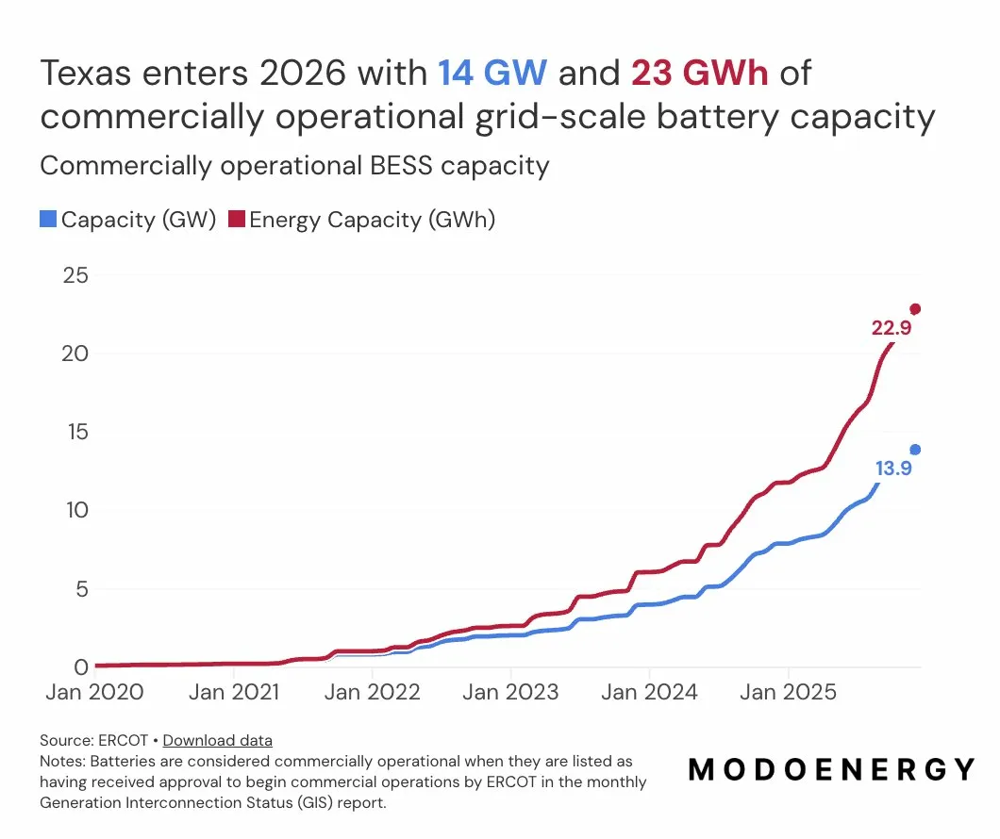
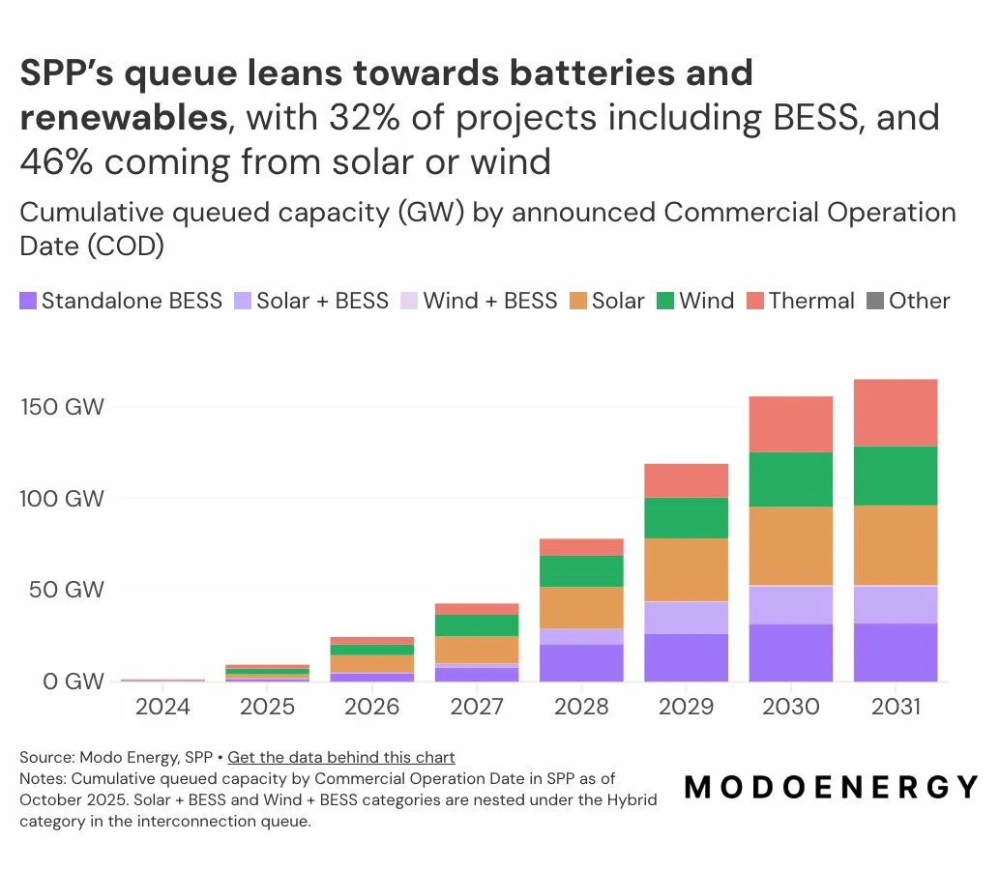

# Project Viability & Speed-to-Market Predictor
### *Which renewable energy projects actually get built — and how fast?*

> **Built for the Modo Energy Market Analyst Open Tech Challenge, March 2026**

---

## The Problem

The US electricity grid is in the middle of a buildout unlike anything in its history. Texas alone entered 2026 with **14 GW and 23 GWh** of commercially operational grid-scale battery capacity — capacity that barely existed five years ago. SPP's interconnection queue now holds over **160 GW** of queued capacity with announced commercial operation dates through 2031, with 32% of those projects including battery storage.

<p align="center">
  
  
</p>

*Source: Modo Energy — ERCOT Annual Buildout Report (2026) and SPP Battery Buildout Outlook (2025)*

But here is the problem buried inside that growth story: **only 1 in 6 projects that enters a US interconnection queue ever reaches commercial operation.** The rest withdraw — often after years of costly feasibility work, interconnection deposits, and developer time. For ERCOT specifically, Modo Energy's own research highlights that new battery applications are declining, driven by falling merchant revenues (dropping from $192/kW in 2023 to $43/kW in 2024–2025) and rising costs from tariff impacts and ITC restrictions.

For asset developers, investors, and infrastructure funds evaluating a pipeline of projects, the central question is not whether a project *can* be interconnected — it is whether it *will* be built, and on what timeline. That question is currently answered by gut instinct, anecdotal benchmarks, or expensive consultants. **No data-driven tool exists at the point of application submission to score project viability before study costs are incurred.**

This is exactly the kind of market opacity that Modo Energy is built to resolve. Their platform already benchmarks operational revenue and forecasts buildout trajectories. A project viability predictor extends that lens upstream — into the development pipeline stage, before a single dollar of interconnection study cost is spent.

---

## What Was Built

A **two-model ML system** trained on 24,690 projects from the LBNL Interconnection Queue dataset (1970–2024):

| Model | Task | Key Metric |
|---|---|---|
| **XGBoost Classifier** | Probability a project reaches commercial operation | AUC-ROC = 0.851 (val) |
| **XGBoost Regressor** | Expected queue duration in months (completed projects) | RMSE = 14.3 months vs 21.9 month baseline (val) |

Together, the models produce a **viability score** for any project at the point of its interconnection application — combining completion probability and expected time-to-market into a single portfolio-screening signal.

---

## So What?

Modo Energy is actively building AI-powered valuation tools as part of its platform roadmap, helping over 3,000 teams globally evaluate risk, benchmark performance, and model the future. Their ERCOT research already asks: *"How long does it take to move through ERCOT's interconnection queue, and how much of the 200+ GW queue is likely to achieve commercial operation?"* This tool answers those questions with a trained model rather than expert judgment alone.

An asset owner or infrastructure fund with a pipeline of 50 projects could score every project at submission and concentrate development spend on those most likely to reach commercial operation fastest — the same logic Modo applies to operational benchmarking, extended one step earlier in the asset lifecycle. The regressor cuts the ISO-mean baseline error by **35%**, meaning it adds genuine predictive signal beyond simply knowing which region a project is in.

The feature attribution layer is equally valuable: it produces auditable, quantified explanations for *why* certain projects succeed — the kind of defensible insight that underpins project finance decisions.

---

## Key Findings

### 1. Two observable signals at submission time predict both completion and speed

The two most actionable findings come from reading the classifier and regressor feature importance charts side by side:


**Service type (NRIS/ERIS) is the #1 completion predictor.** Projects that request both Network Resource Interconnection Service and Energy Resource Interconnection Service simultaneously — requiring full network access rights rather than energy-only delivery — are the highest-completion-rate applicants in the dataset. This is a capital commitment signal: NRIS/ERIS applicants have underwritten the cost of a more complex study because they need firm transmission. It is visible on day one of the application.

**Filing with a proposed online date (#6 for completion, #3 for duration) is the most actionable signal.** Developers who submit an interconnection request with a target commercial operation date are significantly more likely to complete and, among those that do complete, move through the queue faster. This is a commitment signal — it indicates the project has a financing timeline, a PPA in negotiation, or a regulatory deadline driving it. Critically, it is the single cheapest piece of information to collect: it costs nothing to observe, and it predicts both *whether* a project gets built and *how quickly*. For a platform like Modo's that tracks project pipelines, flagging whether a proposed date was filed at submission is a one-line data enrichment that immediately improves viability scoring.

Other notable top features in the classifier: **`iso_region_SPP`** (SPP applicants have historically higher completion rates), **`tech_bucket_Solar`** and **`tech_bucket_Gas`** (technology type interacts strongly with vintage era), and **`is_slow_iso`** (PJM and MISO applicants face a structurally harder path). In the regressor, **`tech_bucket_Hybrid`** dominates duration predictions — more on this below.

---

### 2. Solar+Battery hybrids take measurably longer, even when they complete

`tech_bucket_Hybrid` is the single strongest predictor of queue duration, accounting for 15.6% of regressor feature importance — nearly double the next feature. Solar+Battery and Wind+Battery projects that successfully complete their interconnection process take significantly longer than single-technology projects.

This matters directly for Modo's customers. As SPP's queue increasingly leans toward hybrid projects (32% of queued capacity includes BESS), developers and investors need to build longer interconnection timelines into their financial models. The 14.3-month RMSE on the regressor translates to a planning-relevant margin of error: for a hybrid project with a 42-month median duration, the model narrows uncertainty from a 22-month ISO-baseline RMSE to 14 months — a 35% improvement in forecasting precision.

`proposed_lead_years` (how far ahead the developer planned their commercial operation date) is the second strongest duration predictor, showing a near-linear relationship: every additional year of planned lead time adds roughly 10–15 months of actual queue duration. This is not a coincidence — developers who plan longer runways do so because they know their project faces a complex multi-technology study environment.


---

### 3. Where a project is matters as much as what it is — but the story is more nuanced than a ranking

ISO region is consistently among the top predictors in both models.


**SPP (25%) and ISO-NE (20%)** show the highest fast-mover rates — projects here are most likely to score in the top decile for both completion probability and predicted speed. SPP's central plains geography hosts fewer competing projects per transmission node and has historically run a more orderly queue. ISO-NE's small footprint and strong historical completion discipline reinforce a similar pattern.

**CAISO, NYISO, and ERCOT all show near-zero fast-mover rates.** This deserves careful interpretation:

For **CAISO and NYISO**, the result is structurally expected. Both markets have seen thousands of solar and battery submissions compete for limited transmission capacity in congested coastal grids. Queue backlogs are severe, study timelines have extended, and withdrawal rates are among the highest in the country. The model has correctly learned this pattern from historical data.

**ERCOT is more complex.** Despite entering 2026 with 14 GW of commercially operational BESS — the most of any US market — ERCOT's fast-mover rate is near zero. The reason: ERCOT's queue has simultaneously exploded to 200+ GW of new applications, meaning the *ratio* of projects that make it through has collapsed even as the absolute number of completions has grown. The model, trained on pre-2019 data when ERCOT's queue was far more manageable, underestimates ERCOT's current structural congestion. This is both an honest model limitation *and* a real market signal: ERCOT's success in completing projects has attracted so much new capital that the queue itself has become the bottleneck — exactly the dynamic Modo's buildout research documents.

**On the technology fast-mover chart:** the ranking of Nuclear and Hydro at the top and Battery/Solar at the bottom is a historical artefact, not a forward-looking verdict. Legacy technologies completed in a less competitive era with utility-sponsored capital. For Modo's customers — whose entire business is built on batteries and renewables — the relevant question is not which technology historically had the best completion rate, but which *combination* of region, technology, and timing gives a modern battery or solar project the best odds today. That is what the viability score is designed to answer: a Battery project in SPP filed in 2022 scores very differently from the same project filed in CAISO in the same year, and the model captures that difference.

---

### 4. What actually drives completion probability — a plain-English guide to the SHAP chart

The SHAP beeswarm below shows, for 2,000 projects, how much each feature pushed the completion probability up (right of centre) or down (left of centre). Each dot is one project; red means that project had a high value for that feature, blue means low.


Three patterns stand out in plain terms:

**Project size works against very large projects.** `log_capacity_mw` is the top feature, but red dots (large projects) cluster on the *left* — meaning large capacity actually reduces predicted completion probability. This is counterintuitive but makes sense: large projects trigger more extensive network upgrade requirements, face higher capital hurdles, and attract more regulatory scrutiny. Small projects (blue, right side) are simpler to study and cheaper to abandon if circumstances change, so developers who stick with them tend to be more committed.

**Older queue entries had a real advantage.** `queue_year` shows that projects which entered the queue in earlier years (blue, right side) have higher predicted completion rates than recent entrants (red, left side). This captures a real structural shift: before 2019, the average ISO queue had far fewer competing projects per transmission node. Today's queues are overwhelmed. A project entering PJM or CAISO in 2023 faces a fundamentally different competitive environment than the same project in 2012 — and the model has learned this from the data.

**Queue congestion adds a real but secondary penalty.** `log_queue_backlog` (the number of projects that entered the same ISO in the prior 3 years) nudges completion probability downward when congestion is high (red, left). But the effect is smaller than region identity or service type — meaning *which* ISO you are in matters more than *how busy* it happens to be at the moment of submission.

---

### 5. Case Studies: what the model says about two real projects

**Fast-mover (high completion probability)**

A large-capacity Fossil project in ISO-NE, where raw scale (`log_capacity_mw`) is the dominant positive driver. ISO-NE's historically strong completion discipline further supports the prediction. The `is_hybrid` flag partially offsets the signal — even here, hybrid complexity is a headwind — but the overall viability score remains high.


**High-risk project (low completion probability)**

A project where very large capacity and high queue backlog combine to push the prediction far below baseline. The `service_type_NRIS/ERIS` flag, which is a positive signal when it reflects genuine commitment, here indicates complexity rather than conviction. Every feature pulls in the same direction: this project entered a congested ISO at large scale with a profile that historically precedes withdrawal.


---

## Model Performance

### Classifier

| Split | AUC-ROC | AUC-PR | n | Pos. Rate |
|---|---|---|---|---|
| Train (pre-2019) | 0.888 | 0.702 | 16,270 | 21.8% |
| Val (2019–2021) | 0.851 | 0.384 | 5,213 | 7.1% |
| Test (2022–2024) | 0.771 | 0.114 | 3,207 | 2.3% |

An AUC-ROC of 0.851 on the validation set means the model correctly ranks 85% of completed vs withdrawn project pairs by completion probability — well above random. The AUC-PR drop to 0.114 on the test set reflects data maturity: 2022–2024 projects have not had sufficient time to complete, so the measured positive rate (2.3%) understates their true long-run completion probability. Validation metrics are the appropriate performance benchmark.

### Regressor

| Split | RMSE | MAE | R² | ISO-Baseline RMSE |
|---|---|---|---|---|
| Train | 13.3 mo | 8.9 mo | 0.813 | 28.8 mo |
| Val | 14.3 mo | 11.2 mo | 0.344 | 21.9 mo |

The model reduces ISO-mean baseline error by **35%** on the validation set. On a median queue duration of 42.5 months, a 14.3-month RMSE represents a practically meaningful improvement in planning precision.


---

## Data

**Source:** [LBNL Interconnection Queue ("Queued Up"), 2024 release](https://emp.lbl.gov/publications/queued-tracking-progress-clean)

See `data/downloading from LBNL` for download instructions. The raw Excel file is not committed to this repo due to size.

**Coverage:** 36,441 projects across all major US ISOs, 1970–2024
**Modelling subset:** 24,690 completed or withdrawn projects (active and suspended excluded from supervised targets)

---

## Features

All features use only information observable at or before the queue entry date to prevent data leakage.

| Feature | Type | Description |
|---|---|---|
| `log_capacity_mw` | Numeric | Log-transformed MW capacity |
| `log_queue_backlog` | Numeric | Log of 3-year rolling project count in same ISO |
| `proposed_lead_years` | Numeric | Proposed online year minus queue entry year |
| `queue_year`, `queue_month`, `queue_quarter` | Numeric | Temporal entry features |
| `is_hybrid` | Binary | Whether project combines multiple technologies |
| `is_slow_iso` | Binary | PJM or MISO flag (historically longer queues) |
| `is_nris` | Binary | Network Resource Interconnection Service flag |
| `has_proposed_date` | Binary | Developer filed a target online date |
| `post_ferc_2003`, `post_ferc_2023` | Binary | Regulatory reform era indicators |
| `itc_active`, `ptc_bonus_period`, `ira_era` | Binary | Federal subsidy policy cycle flags |
| `iso_region` | Categorical | ISO/RTO region (9 categories) |
| `tech_bucket` | Categorical | Technology type (Solar, Wind, Battery, Hybrid, etc.) |
| `capacity_bucket` | Categorical | Small / Mid / Large / Utility size tier |
| `service_type` | Categorical | NRIS / ERIS / NRIS+ERIS / Other |
| `queue_decade` | Categorical | Decade of queue entry |

---

## Limitations

**ERCOT recent dynamics not fully captured.** The model was trained on pre-2019 data. ERCOT's post-2020 queue explosion — from a manageable pipeline to 200+ GW of new applications — is not well-represented in the training set. ERCOT predictions should be treated as lower bounds on viability, not current estimates.

**Survivorship bias in legacy tech types.** Nuclear and Hydro rank highest in the fast-mover technology profile due to small samples of pre-2000 legacy plants that completed in a fundamentally different market environment. Forward-looking signals for modern clean energy portfolios come from Solar, Wind, Battery, and Hybrid categories.

**Correlation, not causation.** SHAP importance is associative. High importance of ISO region reflects correlated structural differences — regulatory environment, grid topology, market design — not a single causal mechanism.

**Test set maturity.** The classifier's test AUC-PR of 0.114 reflects data immaturity (2022–2024 projects have not had time to complete), not model failure. AUC-ROC = 0.851 on the validation set is the appropriate benchmark.

**Missing duration data.** Approximately 50% of projects lack a recorded end date, limiting the regression training set to 1,722 rows. A survival model (Cox PH or AFT) would allow active projects to be included as censored observations and is a natural extension.

**FERC Order 2023.** Cluster study reforms took effect in late 2023. The model treats this as a binary era flag; its full impact on queue dynamics will only be measurable with several more years of outcome data.

---

## Repo Structure

```
Speed-to-Market-Predictor/
├── README.md
├── how_to_run_colab_version.py    <- full pipeline as Colab-ready cells
├── data/
│   └── downloading from LBNL     <- data source and download instructions
├── src/
│   ├── data_loader.py             <- loads and cleans LBNL xlsx, builds targets
│   ├── features.py                <- feature engineering and sklearn preprocessor
│   ├── models.py                  <- trains and evaluates both XGBoost models
│   └── shap_analysis.py           <- SHAP attribution and all visualisations
├── outputs/                       <- all generated plots
└── Xueru Zhao-Resume-20260220.pdf
```

---

## How to Run

**Option A — Google Colab (recommended)**

Open `how_to_run_colab_version.py` and run cells sequentially. The file is structured as annotated Colab cells and handles Google Drive mounting automatically.

**Option B — Local**

```bash
# 1. Install dependencies
pip install pandas numpy scikit-learn xgboost shap matplotlib openpyxl

# 2. Download data from LBNL (see data/downloading from LBNL)
#    Place file at: data/raw/lbnl_ix_queue_data_file_thru2024.xlsx

# 3. Run pipeline
python src/data_loader.py  data/raw/lbnl_ix_queue_data_file_thru2024.xlsx
python src/models.py       data/raw/lbnl_ix_queue_data_file_thru2024.xlsx
python src/shap_analysis.py
```

`features.py` is imported automatically by `models.py` and `shap_analysis.py` — it does not need to be run directly.

---

## AI Workflow

Claude (Anthropic) was used as a coding collaborator to generate the Python code across `data_loader.py`, `features.py`, `models.py`, and `shap_analysis.py`, and to debug issues during execution. The problem framing, data source selection, feature design decisions, and all findings interpretations are my own work.
