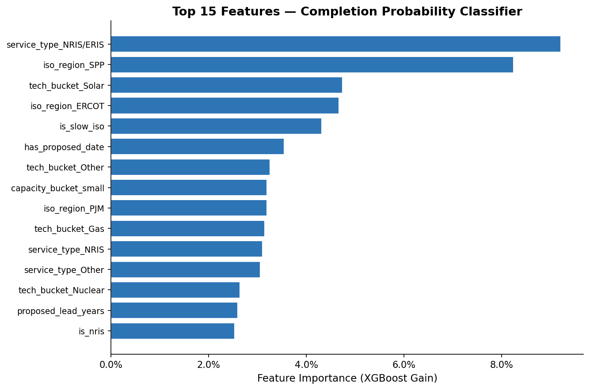
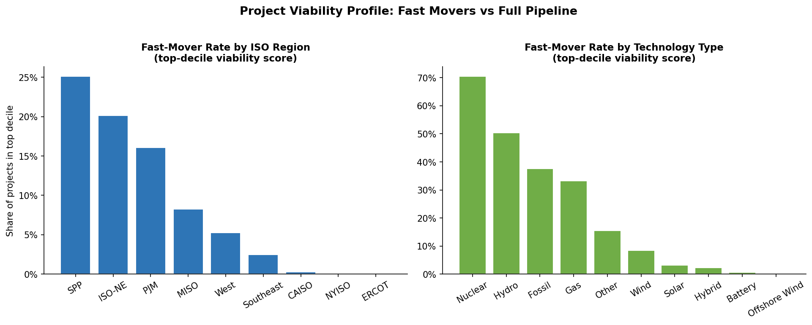
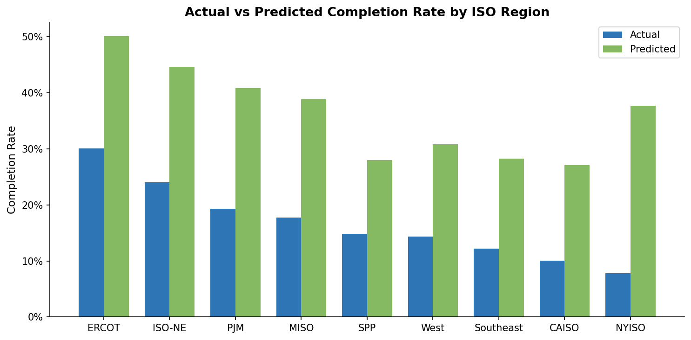
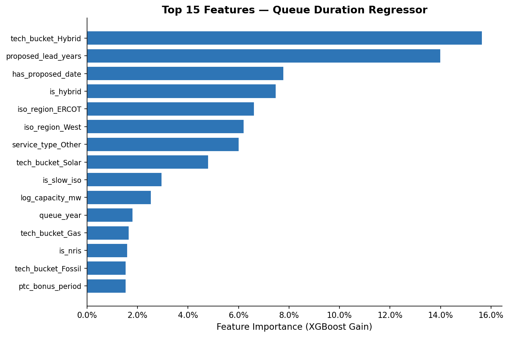
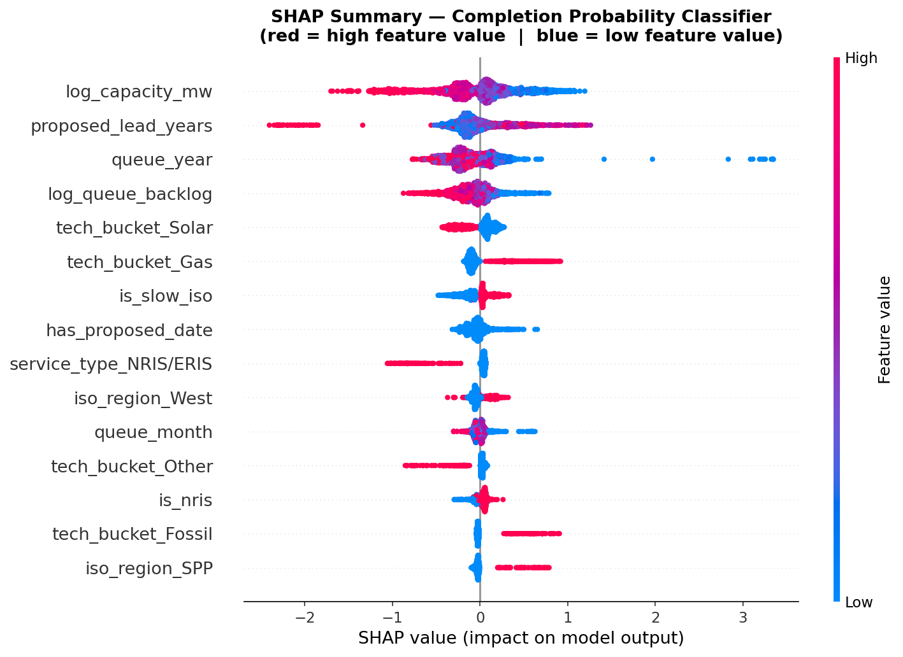
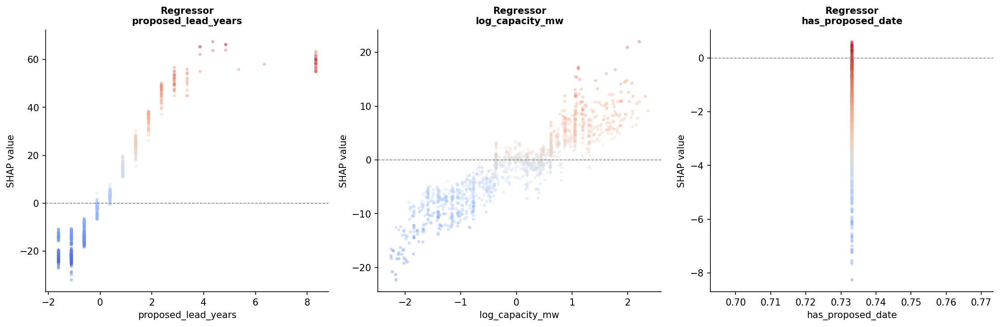
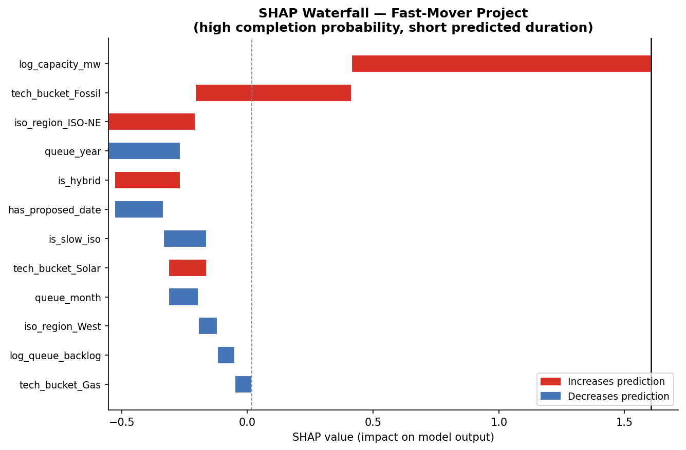
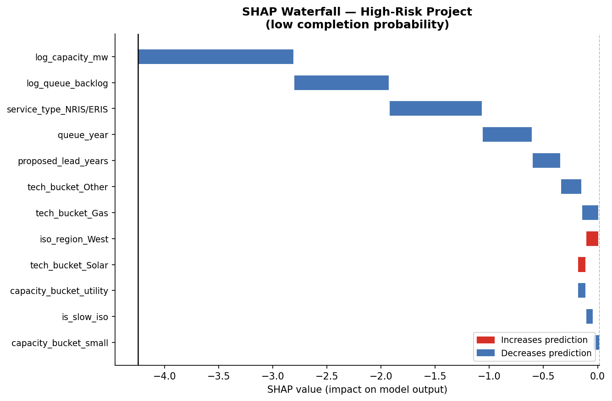
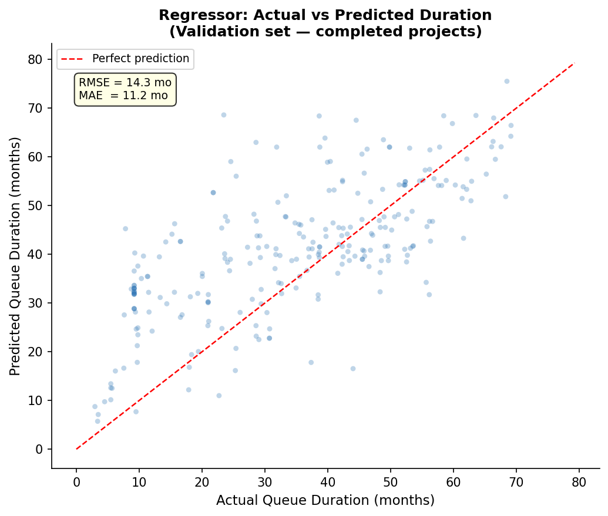

# Project Viability & Speed-to-Market Predictor
### *Which renewable energy projects actually get built — and how fast?*

---

## The Problem

Only **1 in 6 projects** that enters a US interconnection queue ever reaches commercial operation. The rest withdraw — often after years of costly development work. For asset developers, investors, and infrastructure funds evaluating a pipeline of projects, the central question is not whether a project *can* be permitted, but whether it *will* be built, and on what timeline.

This tool uses 24 years of historical interconnection queue data to answer that question quantitatively — at the time of application submission, before any study costs are incurred.

---

## What Was Built

A **two-model ML system** trained on 24,690 projects from the LBNL Interconnection Queue dataset (1970–2024):

| Model | Task | Key Metric |
|---|---|---|
| **XGBoost Classifier** | Probability a project reaches commercial operation | AUC-ROC = 0.851 (val) |
| **XGBoost Regressor** | Expected queue duration in months (completed projects) | RMSE = 14.3 months vs 21.9 month baseline (val) |

Together, the models produce a **viability score** for any project at the time of its interconnection application — combining completion probability and expected time-to-market into a single portfolio-screening signal.

---

## So What?

A tool like this sits naturally inside a platform like Modo Energy's: an asset owner or infrastructure fund with a pipeline of 50 projects could score every project at submission and prioritise development spend toward those most likely to reach commercial operation fastest. The regressor cuts the ISO-mean baseline error by **35%**, meaning it adds real information beyond simply knowing which region a project is in.

The feature attribution analysis also produces commercially useful findings about *why* certain projects succeed — findings that hold up to scrutiny as first-principles market insights, not statistical artefacts.

---

## Key Findings

### 1. Service type is the strongest completion signal

`service_type_NRIS/ERIS` is the top classifier feature. Projects requesting both Network Resource Interconnection Service and Energy Resource Interconnection Service simultaneously are the highest-completion-rate applicants in the dataset. These projects need full network access rights — a signal that the developer has committed serious capital and requires firm transmission, not just energy-only delivery. It is a behavioural indicator of project seriousness that is observable on day one.



### 2. Filing with a proposed online date predicts both completion and speed

`has_proposed_date` is a top-5 feature in both models. Developers who submit an interconnection request with a target commercial operation date are significantly more likely to complete and, among completers, take less time. This is a commitment signal: it indicates the project has a power purchase agreement in negotiation, a financing timeline, or a regulatory deadline driving it. It is the single cheapest piece of information to collect at the point of application.

### 3. Regional differences are large and persistent

ISO region is consistently among the top predictors in both models, confirming that where a project is located shapes its trajectory as much as what it is. The fast-mover profile chart below makes this concrete:



**SPP (25%) and ISO-NE (20%)** show the highest fast-mover rates. SPP's central plains geography hosts fewer competing projects and has historically run a less congested queue. ISO-NE's small footprint and high historical completion discipline contribute similarly. **CAISO (~0%) and NYISO (~0%)** show near-zero fast-mover rates, reflecting the well-documented congestion in California and New York markets where thousands of solar and storage projects compete for limited transmission capacity.

The model correctly preserves the regional ranking in its completion rate predictions:



> **Note on predicted vs actual rates:** predicted completion rates appear higher than actuals across all ISOs. This is expected: the model was trained on pre-2019 data where 21.8% of projects completed. When applied to the full dataset — including 2020–2024 projects that are still active — the model correctly assigns high long-run completion probabilities to projects that *would* complete given time. The actuals look low because those cohorts are not yet resolved.

### 4. Hybrid projects take longer, even when they complete

`tech_bucket_Hybrid` is the dominant regressor feature (15.6% gain importance). Solar+Battery and Wind+Battery projects that successfully complete their interconnection process take meaningfully longer than single-technology projects. This reflects the genuine complexity of multi-technology interconnection studies, which must model both generation and storage dispatch profiles simultaneously. For a developer scheduling project finance timelines, this is a quantified planning input.



### 5. Queue backlog has directional but weak signal on completion probability

`log_queue_backlog` (3-year rolling count of projects entering the same ISO) appears in the top features for the classifier beeswarm but with low SHAP magnitude. High backlog nudges completion probability slightly downward — consistent with the hypothesis that congested queues have higher withdrawal rates — but the effect is smaller than regional identity and service type. This suggests that *which* ISO matters more than *how many* projects are currently in it.



### 6. Proposed lead time has a strong, near-linear effect on duration

The regressor dependence plot for `proposed_lead_years` shows one of the clearest relationships in the analysis: longer planned lead times translate almost linearly into longer actual queue durations, up to 4–5 years. Projects planning 8+ year runways see SHAP contributions of +60 months on predicted duration. This is not a tautology — it captures the behaviour of developers who plan longer because they know their project faces a complex study environment.



---

## Case Studies

### Fast-mover project (high completion probability)

A large-capacity (`log_capacity_mw` is the top contributor) Fossil project in ISO-NE, with its `is_hybrid = 1` flag partially offsetting the positive signals. The classifier scores this project well primarily on the strength of its capacity and technology type combination.



### High-risk project (low completion probability)

A project where very large capacity (`log_capacity_mw`) and high queue backlog (`log_queue_backlog`) both push the prediction strongly negative. The `service_type_NRIS/ERIS` feature further suppresses completion probability — in this case the hybrid service type reflects complexity rather than commitment. Every feature in this waterfall is pulling the prediction below baseline.



---

## Model Performance

### Classifier

| Split | AUC-ROC | AUC-PR | n | Pos. Rate |
|---|---|---|---|---|
| Train (pre-2019) | 0.888 | 0.702 | 16,270 | 21.8% |
| Val (2019–2021) | 0.851 | 0.384 | 5,213 | 7.1% |
| Test (2022–2024) | 0.771 | 0.114 | 3,207 | 2.3% |

The AUC-PR drop from val (0.384) to test (0.114) reflects the declining completion rate in recent cohorts — not model degradation. 2022–2024 projects have not had sufficient time to complete; the test set positive rate of 2.3% is a data maturity issue, not a signal failure.

### Regressor

| Split | RMSE | MAE | R² | ISO-Baseline RMSE |
|---|---|---|---|---|
| Train | 13.3 mo | 8.9 mo | 0.813 | 28.8 mo |
| Val | 14.3 mo | 11.2 mo | 0.344 | 21.9 mo |

The model reduces the ISO-mean baseline error by **35% on the validation set**. R² of 0.344 is moderate but expected for a noisy real-world outcome with only 1,722 training rows of completed projects. The actual vs predicted scatter shows good calibration in the 20–60 month range (where most projects fall), with higher variance at extreme durations.



---

## Data

**Source:** [LBNL Interconnection Queue ("Queued Up"), 2024 release](https://emp.lbl.gov/publications/queued-tracking-progress-clean)

Download the Excel file and place it at `data/raw/lbnl_ix_queue_data_file_thru2024.xlsx`. The file is not committed to this repo due to size.

**Coverage:** 36,441 projects across all major US ISOs, 1970–2024  
**Modelling subset:** 24,690 completed or withdrawn projects (active/suspended excluded from supervised targets)

---

## Features

All features use only information observable at or before the queue entry date to prevent data leakage.

| Feature | Type | Description |
|---|---|---|
| `log_capacity_mw` | Numeric | Log-transformed MW capacity |
| `log_queue_backlog` | Numeric | Log of 3-year rolling project count in same ISO |
| `proposed_lead_years` | Numeric | Proposed online year minus queue entry year |
| `queue_year`, `queue_month`, `queue_quarter` | Numeric | Temporal entry features |
| `is_hybrid` | Binary | Whether project combines multiple technologies |
| `is_slow_iso` | Binary | PJM or MISO (historically longer queues) |
| `is_nris` | Binary | Network Resource Interconnection Service flag |
| `has_proposed_date` | Binary | Developer filed a target online date |
| `post_ferc_2003`, `post_ferc_2023` | Binary | Regulatory reform era indicators |
| `itc_active`, `ptc_bonus_period`, `ira_era` | Binary | Federal subsidy policy cycle flags |
| `iso_region` | Categorical | ISO/RTO region (9 categories) |
| `tech_bucket` | Categorical | Technology type (Solar, Wind, Battery, Hybrid, etc.) |
| `capacity_bucket` | Categorical | Small / Mid / Large / Utility size tier |
| `service_type` | Categorical | NRIS / ERIS / NRIS+ERIS / Other |
| `queue_decade` | Categorical | Decade of queue entry |

---

## Limitations

**Survivorship bias in legacy tech types.** Nuclear ranks highest in the fast-mover technology profile due to its small sample of pre-2000 legacy plants that completed under fundamentally different conditions. This is not a forward-looking signal. Commercially actionable technology findings are in Solar, Wind, Battery, and Gas — the high-volume modern categories.

**Test set maturity.** Projects entering queues in 2022–2024 have not had time to complete. The classifier's test AUC-PR of 0.114 reflects data immaturity, not model failure. Validation metrics (AUC-ROC = 0.851) are the appropriate performance benchmark.

**Correlation, not causation.** SHAP feature importance is associative. High importance of ISO region reflects correlated structural differences between markets — regulatory environment, grid topology, market design — not a single causal mechanism.

**FERC Order 2023.** The model was trained before the cluster study reforms took full effect. Predictions for 2024+ projects should be treated as priors subject to recalibration as post-reform outcomes accumulate.

**Missing data.** ~50% of projects lack a recorded completion or withdrawal date, limiting the regression training set to 1,722 rows. A survival model (Cox PH or accelerated failure time) would allow active projects to be included as censored observations and is a natural next step.

---

## Repo Structure

```
project-viability-predictor/
├── README.md
├── data/
│   └── README.md              ← download instructions for LBNL dataset
├── src/
│   ├── data_loader.py         ← loads + cleans LBNL xlsx, builds targets
│   ├── features.py            ← feature engineering + sklearn preprocessor
│   ├── models.py              ← trains + evaluates both XGBoost models
│   └── shap_analysis.py       ← SHAP attribution + all visualisations
├── outputs/                   ← generated plots (gitignored if large)
└── resume.pdf
```

---

## How to Run

```bash
# 1. Install dependencies
pip install pandas numpy scikit-learn xgboost shap matplotlib openpyxl

# 2. Place data file at:
#    data/raw/lbnl_ix_queue_data_file_thru2024.xlsx

# 3. Run full pipeline
python src/data_loader.py   data/raw/lbnl_ix_queue_data_file_thru2024.xlsx
python src/models.py        data/raw/lbnl_ix_queue_data_file_thru2024.xlsx
python src/shap_analysis.py  # requires clf_pre, clf, reg_pre, reg from models.py
```

For an interactive walkthrough, the pipeline was developed and validated in Google Colab. See the inline comments in each `src/` file for cell-by-cell usage.

---

## AI Workflow

This project was built with Claude (Anthropic) as a coding and analysis collaborator across the full pipeline — from data exploration and feature engineering decisions through to model evaluation and README narrative. Claude was used to accelerate code iteration, catch bugs (index alignment errors in evaluation, duplicate column issues in SHAP profiling), and stress-test analytical interpretations against domain knowledge. The energy market framing, feature design choices (e.g. `has_proposed_date` as a commitment signal, policy era binary flags), and all findings interpretations are my own.
